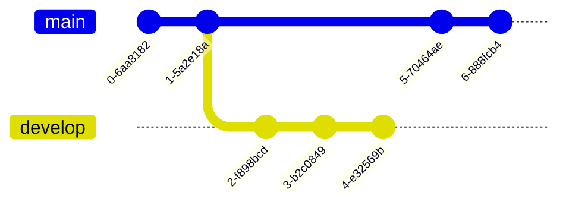

 

 
 
<h1 align="center">

About me

</h1>
 
Get dynamically generated GitHub stats!

  
  
  
  
   

Currently, I am a Software Engineering student at Wuhan University. A confident, creative, enthusiastic, adaptive, and fast-learning person who is highly motivated, willing to learn new things, and comes to you with theoretical and technical skills and a solid academic background in computer science and technology. I am seeking the opportunity to learn new things and a challenging work environment that will encourage me to do my best for the sake of helping myself and the university advance in the field of computer science and technology.

-  I’m currently working on SLAM
-  I’m currently learning Robotics and Machine Learning
-  I’m looking to collaborate on Software architecture
-  I’m looking for help with ...
-  Ask me about Robotics and Machine Learning
-  How to reach me: WeChat: shamim_10010
-  Pronouns: Shamim
-  Fun fact: ...

---

<h1> Socials:</h1>

#  Tech Stack:

                                                         

#  GitHub Stats:
 
 

#  GitHub Trophies

#  Random Dev Quote

---

 ##  You can help me by Donating
  

